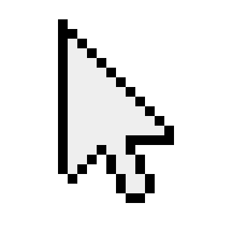

<div align="center" width="50">
    
</div><br/>

<h1 align="center">𝙷𝚘𝚕𝚊 , 𝚜𝚘𝚢 𝙳𝚒𝚎𝚐𝚘 𝙽𝚒𝚎𝚟𝚎𝚜</h1>

-  &nbsp; 𝙴𝚜𝚝𝚘𝚢 𝚍𝚎𝚜𝚊𝚛𝚛𝚘𝚕𝚕𝚊𝚗𝚍𝚘 𝚎𝚗 **𝙵𝚕𝚞𝚝𝚝𝚎𝚛 & 𝚆𝚎𝚋**. <br>
- &nbsp;&nbsp;&nbsp; 𝙼𝚎 𝚐𝚞𝚜𝚝𝚊𝚛𝚒𝚊 𝚌𝚘𝚗𝚘𝚌𝚎𝚛 𝚎𝚕 **𝙼𝚄𝙽𝙳𝙾**. <br>
- &nbsp;&nbsp; 𝙳𝚒𝚜𝚏𝚛𝚞𝚝𝚘 𝚖𝚞𝚌𝚑𝚘 𝚍𝚎 𝚕𝚊𝚜 **𝙿𝚎𝚕𝚒𝚌𝚞𝚕𝚊𝚜 𝚢 𝚅𝚒𝚍𝚎𝚘𝚓𝚞𝚎𝚐𝚘𝚜**. <br>
-  &nbsp; 𝙰𝚐𝚛𝚎𝚐𝚊𝚖𝚎 𝚎𝚗 𝙻𝚒𝚗𝚔𝚎𝚍𝚒𝚗: **[𝙸𝙾](https://www.linkedin.com/in/diego-nieves-04b409242/)**.<br>
-  &nbsp;&nbsp; 𝚃𝚘𝚍𝚘𝚜 𝚖𝚒𝚜 𝚙𝚛𝚘𝚢𝚎𝚌𝚝𝚘𝚜 𝚎𝚜𝚝á𝚗 𝚍𝚒𝚜𝚙𝚘𝚗𝚒𝚋𝚕𝚎𝚜 𝚎𝚗 [Mi portafolio](https://dlc.nvs.com.es/).<br>
-  &nbsp;&nbsp; 𝙼𝚒 𝚎𝚖𝚊𝚒𝚕 **nieves.diego0426@gmail.com**.<br>

```javascript
// Tal vez no sea experto pero son mis bebes...
class Sobre_Mi { 
  const MIS_HERRAMIENTAS = {  
    LENGUAJES_DE_PROGRAMACION : { "JavaScript", "Dart", "Python" },
    LENGUAJES_INFORMATICOS : { "HTML", "CSS", "Json" },
    LIBRERIAS_Y_FRAMEWORKS : { "Bootstrap", "TailwindCSS", "ReactJS", "Flutter", "Sin espacio" }
    BASE_DE_DATOS : { "Firebase", "PostgreSQL", "MySQL", "MongoDB" },
    EDITOR_DE_COD : { "Vscode" },
    OTROS : { "Git", "Figma" }
  };
}
```
<hr></hr>


<h3 align="center">𝙵𝚁𝙾𝙽𝚃-𝙴𝙽𝙳, 𝚌𝚘𝚗 𝚌𝚘𝚗𝚘𝚌𝚒𝚖𝚒𝚎𝚗𝚝𝚘𝚜 𝚍𝚎 𝙱𝙰𝙲𝙺-𝙴𝙽𝙳 𝚍𝚎 𝙿𝙴𝚁Ú </h3>
<div align="center">
    <p>   </p>
</div><br/>

📊 **𝚄𝚕𝚝𝚒𝚖𝚊𝚖𝚎𝚗𝚝𝚎 𝚖𝚎 𝚕𝚊 𝚙𝚊𝚜𝚘 𝚎𝚗:**
<!--Prueba-->

```text
JavaScript   7 hrs 45 mins   ██████████████▓░░░░░░   48.31 %
Reactjs      6 hrs 14 mins   ██████▒░░░░░░░░░░░░░░   25.11 %
CSS          34 mins         ▓░░░░░░░░░░░░░░░░░░░░   02.28 %
Libre        8 hrs 22 mins   ██████▒░░░░░░░░░░░░░░   25.28 %
```

<h3 align="left">Lenguajes y Herramientas:</h3>
<p align="left"><a href="https://getbootstrap.com" target="_blank" rel="noreferrer">  </a> <a href="https://expressjs.com" target="_blank" rel="noreferrer">  </a> <a href="https://firebase.google.com/" target="_blank" rel="noreferrer">  </a> <a href="https://git-scm.com/" target="_blank" rel="noreferrer">  </a> <a href="https://heroku.com" target="_blank" rel="noreferrer">  </a> <a href="https://www.w3.org/html/" target="_blank" rel="noreferrer">  </a> <a href="https://developer.mozilla.org/en-US/docs/Web/JavaScript" target="_blank" rel="noreferrer">  </a> <a href="https://www.mongodb.com/" target="_blank" rel="noreferrer">  </a> <a href="https://nodejs.org" target="_blank" rel="noreferrer">  </a> <a href="https://www.postgresql.org" target="_blank" rel="noreferrer">  </a> <a href="https://postman.com" target="_blank" rel="noreferrer">  </a> <a href="https://pugjs.org" target="_blank" rel="noreferrer">  </a> <a href="https://redux.js.org" target="_blank" rel="noreferrer">  </a> <a href="https://www.w3schools.com/css/" target="_blank" rel="noreferrer">  </a>  <a href="https://reactjs.org/" target="_blank" rel="noreferrer">  </a> </p>


<p align="right"> <a href="https://discord.gg/K5tUgbWvpG" target="_blank" rel="noreferrer"></a><div width="20"></div> <a href="https://www.linkedin.com/in/diego-nieves-04b409242/" target="_blank" rel="noreferrer"></a></p>

